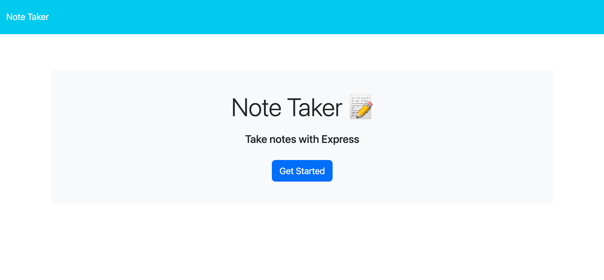

# notes-challenge

## Table of Contents
* [Description](#description)
* [Installation](#installation)
* [Usage](#usage)
* [Contributing](#contributing)
* [Tests](#tests)
* [License](#license)
* [Questions](#questions)
## Description:
This project is intended to allow the user to enter save notes as well as view and delete previously saved ones. This project was made as part of the requirements for a web development bootcamp.

## Installation:
N/A

## Usage:

Link to deployed application: https://notes-challenge-29759823.herokuapp.com/

Upon loading the page, the user is presented with a title screen. After pressing the "Get Started" button, the notes screen will appear, consisting of a list of previously saved notes and a viewer on the right. Click on any of the notes on the left to view the details on the right. The user can also press the "+" button to enter information for a new note. After adding in both the title and note text, a save icon will appear in the uppper right hand corner. Press it to add the new note information to the list of notes on the left. Previously saved notes can also be deleted by clicking on the trash can icon.

## Contributing:
In order to contribute, please feel free to fork the repo and submit a pull request with your suggested improvement.

## Tests:
N/A

## License:
[MIT License](https://opensource.org/license/mit/)

      Permission is hereby granted, free of charge, to any person obtaining a copy of this software and associated documentation files (the “Software”), to deal in the Software without restriction, including without limitation the rights to use, copy, modify, merge, publish, distribute, sublicense, and/or sell copies of the Software, and to permit persons to whom the Software is furnished to do so, subject to the following conditions:
      
      The above copyright notice and this permission notice shall be included in all copies or substantial portions of the Software.
      
      THE SOFTWARE IS PROVIDED “AS IS”, WITHOUT WARRANTY OF ANY KIND, EXPRESS OR IMPLIED, INCLUDING BUT NOT LIMITED TO THE WARRANTIES OF MERCHANTABILITY, FITNESS FOR A PARTICULAR PURPOSE AND NONINFRINGEMENT. IN NO EVENT SHALL THE AUTHORS OR COPYRIGHT HOLDERS BE LIABLE FOR ANY CLAIM, DAMAGES OR OTHER LIABILITY, WHETHER IN AN ACTION OF CONTRACT, TORT OR OTHERWISE, ARISING FROM, OUT OF OR IN CONNECTION WITH THE SOFTWARE OR THE USE OR OTHER DEALINGS IN THE SOFTWARE.
      
      
## Questions:
Please reach out at either of the following locations if you have any additional questions:
* GitHub: [keimdm](https://github.com/keimdm)
* Email: dmk252@cornell.edu
